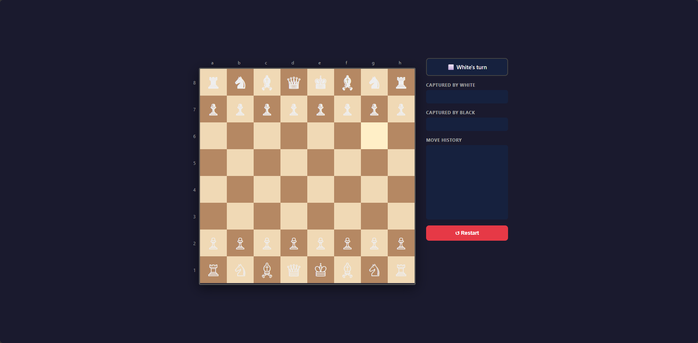

# Chess Game

A fully functional 2-player chess game running entirely in the browser. No server, no framework — pure HTML, CSS, and JavaScript OOP.

## Features

- Full chess rules implemented
- Legal move highlighting when a piece is selected
- Check and checkmate detection
- Stalemate detection
- Castling (kingside and queenside)
- Pawn promotion (choose Queen, Rook, Bishop, or Knight)
- Captured pieces displayed in the side panel
- Move history with algebraic notation
- Turn indicator with check warning
- Drag & drop pieces (HTML5 API)
- Click to select and move pieces
- Restart button

## Architecture

```
Chess-Game/
├── index.html              # Main HTML structure + side panel
├── css/
│   └── style.css           # Board, pieces, highlights, animations
└── js/
├── board.js            # Board class — generates 8x8 grid dynamically
├── game.js             # Game class — orchestrates turns, check, history
└── pieces/
├── Piece.js        # Abstract base class with shared helpers
├── King.js         # King moves + castling logic
├── Queen.js        # Queen sliding moves
├── Rook.js         # Rook sliding moves
├── Bishop.js       # Bishop sliding moves
├── Knight.js       # Knight L-shaped jumps
└── Pawn.js         # Pawn forward moves + diagonal captures

```

## How to run

No installation needed. Just open `index.html` in your browser:

Or with VS Code Live Server: right-click `index.html` → Open with Live Server.

## How to play

1. White always moves first.
2. Click a piece to select it — legal moves are highlighted.
3. Click a highlighted square to move, or drag and drop the piece.
4. Captured pieces appear in the side panel.
5. If your king is in check, the square turns red.
6. Checkmate or stalemate triggers an end-of-game popup.
7. Click **↺ Restart** to start a new game.

## Screenshot


